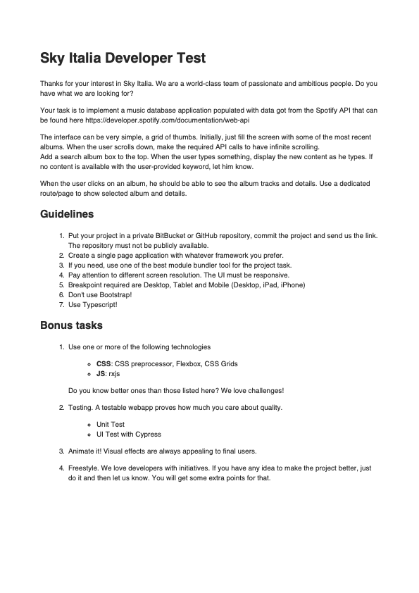

# Spofity-App Sky

## How to Run the Project

To run the Spofity-App Sky project, follow these steps:

1. Clone this repository to your local machine using the following command:

   git clone https://github.com/estephanobrusa/spotify-sky-app.git

2. run yarn install
3. run yarn dev

Link Public:

## Image project

